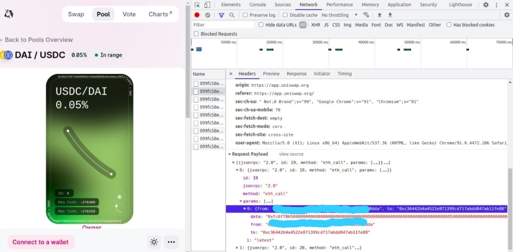

### Project Title
A Telegram Bot that reports how many fees are unclaimed from a Uniswap V3 pool

### Description
The bot is configured at start-up to watch specific pools via environment variables and cli flags (just a list of integers).

### Interaction
`/status`
- Prints a list of registered pools and how much $ is claimable

### Future additions
- In `utils/registered_pools.go`, add parameters for new pools for which the telegram bot is configured to watch
- 
- The above image shows the easiest way to get the parameter values. Copy the `data`, `from` & `to` values.

### How to run
- cd to the root of the repo
- Build the application: `go build main.go`
- Run the application: `./main -k {BOT_KEY} --t 60 -u https://mainnet.infura.io/v3/099fc58e0de9451d80b18d7c74caa7c1`
- Voila! Your telegram bot is live!
